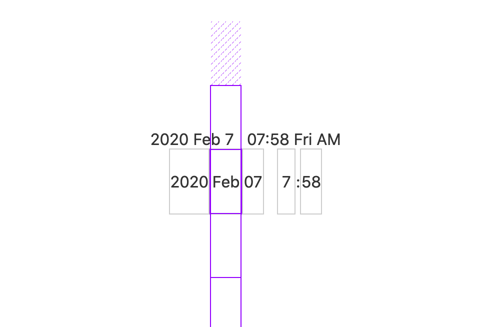

*Looking for a shareable component template? Go here --> [sveltejs/component-template](https://github.com/sveltejs/component-template)*

---

# Scrollable DateTime Picker built with Svelte.js  



A prototype of a scrollable date picker with 'locking' or 'snap' scrolling. iOS' select scroll inspired.

**This is a prototype**, so I would not suggest using this in production has I've not tested it thoroughly on anything at all. 

This is not **DRY** in any sense, don't judge.


### Demo (I removed Sass for demo)
https://svelte.dev/repl/d259226ce3384b2f884414e8f276d0b5?version=3.20.1


## TODO
- [x] 24 hour clock boolean
- [ ] Change MonthDays (currency hardcoded in at 31).. Update on date change or month.
- [ ] Make as component
- [ ] Add props (24 hour clock, etc)
- [ ] Dispatch event to parent, so it can be used as a component.
- [ ] Minute steps. Allow incremements of 5/10, so UX is not so cumbersome to the user. 
- [ ] Test in browsers
- [ ] Add pollyfills if necessary


## Get started

Install the dependencies...

```bash
npm install
```

...then start [Rollup](https://rollupjs.org):

```bash
npm run dev
```

Navigate to [localhost:5000](http://localhost:5000). You should see your app running. Edit a component file in `src`, save it, and reload the page to see your changes.

By default, the server will only respond to requests from localhost. To allow connections from other computers, edit the `sirv` commands in package.json to include the option `--host 0.0.0.0`.


## Building and running in production mode

To create an optimised version of the app:

```bash
npm run build
```

You can run the newly built app with `npm run start`. This uses [sirv](https://github.com/lukeed/sirv), which is included in your package.json's `dependencies` so that the app will work when you deploy to platforms like [Heroku](https://heroku.com).

